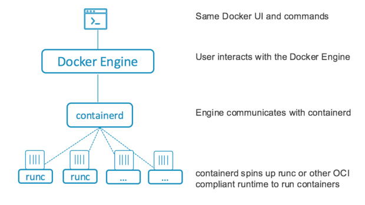

## Container runtimes

Projects

* https://containerd.io/
containerd manages the complete container lifecycle of its host system, from image transfer and storage to container execution and supervision to low-level storage to network attachments and beyond.

From https://stackoverflow.com/questions/41645665/how-containerd-compares-to-runc

> I will give a high level overview to get you started:
>
> * containerd is a container runtime which can manage a complete container lifecycle - from image transfer/storage to container execution, supervision and networking.
> * container-shim handle headless containers, meaning once runc initializes the containers, it exits handing the containers over to the container-shim which acts as some middleman.
>* runc is lightweight universal run time container, which abides by the OCI specification. runc is used by containerd for spawning and running containers according to OCI spec. It is also the repackaging of libcontainer.
>* grpc used for communication between containerd and docker-engine.
>* OCI maintains the OCI specification for runtime and images. The current docker versions support OCI image and runtime specs.
>
> 

### CRI - Container Runtime Interface

Interface specified by Kubernetes.

From https://github.com/kubernetes/community/blob/master/contributors/devel/sig-node/container-runtime-interface.md

CRI (Container Runtime Interface) consists of a specifications/requirements (to-be-added), [protobuf API](https://github.com/kubernetes/kubernetes/tree/master/staging/src/k8s.io/cri-api/pkg/apis/runtime/v1), and libraries for container runtimes to integrate with kubelet on a node. The CRI API is currently in Alpha, and the CRI-Docker integration is used by default as of Kubernetes 1.7+.

Prior to the existence of CRI, container runtimes (e.g., docker, rkt) were integrated with kubelet through implementing an internal, high-level interface in kubelet. The entrance barrier for runtimes was high because the integration required understanding the internals of kubelet and contributing to the main Kubernetes repository. More importantly, this would not scale because every new addition incurs a significant maintenance overhead in the main Kubernetes repository.
